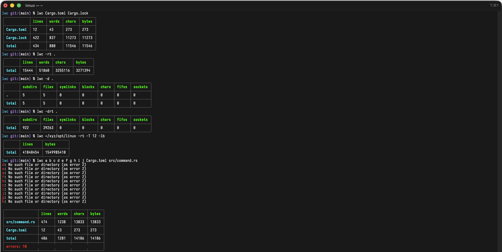

# lwc

`lwc` exists because I've found `wc` unreadable. It's a small, opinionated alternative
that can do pretty much everything `wc` does, plus count directory elements
(sockets, FIFOs, etc.). File contents are expected to be valid UTF-8, which is fine
most of the time but may get weird with binary files or certain encodings. It works
(as least for me), and that's fine.



## Building

Clone the repo `cd` into it, and run either:

```
cargo b     # For debug build
```

or

```
cargo b -r  # For release build
```

For instructions on installing the Rust toolchain refer to the official Rust website.

## Examples

Count lines, words, characters, and bytes in each input files:

```
$ lwc coreutils/src/wc.c coreutils/src/cat.c
╭─────────────────────┬───────┬───────┬───────┬───────╮
│                     │ lines │ words │ chars │ bytes │
├─────────────────────┼───────┼───────┼───────┼───────┤
│ coreutils/src/cat.c │ 829   │ 2954  │ 24433 │ 24434 │
├─────────────────────┼───────┼───────┼───────┼───────┤
│ coreutils/src/wc.c  │ 1023  │ 3612  │ 30378 │ 30378 │
├─────────────────────┼───────┼───────┼───────┼───────┤
│ total               │ 1852  │ 6566  │ 54811 │ 54812 │
╰─────────────────────┴───────┴───────┴───────┴───────╯
```

Use `lwc` with piped input from stdin:

```
$ cat coreutils/src/ls.c | lwc
5631 lines 20392 words 169267 chars 169267 bytes
```

Recursively process all files in a directory and print per-file stats:

```
$ lwc -r linux
#
# ...
#
├──────────────────────────────────────────────────────────────────────────────────────────────────────────────────────┼──────────┼───────────┼────────────┼────────────┤
│ linux/drivers/gpu/drm/amd/display/dc/dce/dmub_psr.c                                                                  │ 510      │ 1617      │ 17163      │ 17163      │
├──────────────────────────────────────────────────────────────────────────────────────────────────────────────────────┼──────────┼───────────┼────────────┼────────────┤
│ linux/drivers/gpu/drm/ast/ast_2000.c                                                                                 │ 257      │ 953       │ 7058       │ 7058       │
├──────────────────────────────────────────────────────────────────────────────────────────────────────────────────────┼──────────┼───────────┼────────────┼────────────┤
│ linux/drivers/media/usb/em28xx/em28xx-cards.c                                                                        │ 4243     │ 13725     │ 127369     │ 127370     │
├──────────────────────────────────────────────────────────────────────────────────────────────────────────────────────┼──────────┼───────────┼────────────┼────────────┤
│ linux/arch/x86/tools/cpufeaturemasks.awk                                                                             │ 88       │ 326       │ 1941       │ 1941       │
├──────────────────────────────────────────────────────────────────────────────────────────────────────────────────────┼──────────┼───────────┼────────────┼────────────┤
│ linux/tools/build/feature/test-sched_getcpu.c                                                                        │ 12       │ 18        │ 166        │ 166        │
├──────────────────────────────────────────────────────────────────────────────────────────────────────────────────────┼──────────┼───────────┼────────────┼────────────┤
│ linux/arch/arm64/lib/error-inject.c                                                                                  │ 18       │ 66        │ 563        │ 563        │
├──────────────────────────────────────────────────────────────────────────────────────────────────────────────────────┼──────────┼───────────┼────────────┼────────────┤
│ linux/sound/isa/gus/gus_tables.h                                                                                     │ 75       │ 587       │ 3966       │ 3966       │
├──────────────────────────────────────────────────────────────────────────────────────────────────────────────────────┼──────────┼───────────┼────────────┼────────────┤
│ linux/Documentation/devicetree/bindings/pci/apm,xgene-pcie.yaml                                                      │ 84       │ 230       │ 2239       │ 2239       │
├──────────────────────────────────────────────────────────────────────────────────────────────────────────────────────┼──────────┼───────────┼────────────┼────────────┤
│ linux/drivers/media/rc/ir-rc6-decoder.c                                                                              │ 407      │ 1167      │ 9687       │ 9689       │
├──────────────────────────────────────────────────────────────────────────────────────────────────────────────────────┼──────────┼───────────┼────────────┼────────────┤
│ linux/Documentation/devicetree/bindings/display/msm/dpu-common.yaml                                                  │ 56       │ 125       │ 1225       │ 1225       │
├──────────────────────────────────────────────────────────────────────────────────────────────────────────────────────┼──────────┼───────────┼────────────┼────────────┤
│ linux/drivers/infiniband/hw/erdma/erdma_eq.c                                                                         │ 326      │ 725       │ 7456       │ 7456       │
├──────────────────────────────────────────────────────────────────────────────────────────────────────────────────────┼──────────┼───────────┼────────────┼────────────┤
│ linux/drivers/watchdog/pic32-dmt.c                                                                                   │ 226      │ 550       │ 4925       │ 4925       │
├──────────────────────────────────────────────────────────────────────────────────────────────────────────────────────┼──────────┼───────────┼────────────┼────────────┤
│ linux/drivers/infiniband/hw/mlx5/cmd.c                                                                               │ 268      │ 721       │ 7899       │ 7899       │
├──────────────────────────────────────────────────────────────────────────────────────────────────────────────────────┼──────────┼───────────┼────────────┼────────────┤
│ linux/arch/sh/include/cpu-common/cpu/pfc.h                                                                           │ 18       │ 40        │ 368        │ 368        │
├──────────────────────────────────────────────────────────────────────────────────────────────────────────────────────┼──────────┼───────────┼────────────┼────────────┤
│ linux/drivers/gpu/drm/nouveau/nvkm/subdev/fb/ramseq.h                                                                │ 17       │ 60        │ 797        │ 797        │
├──────────────────────────────────────────────────────────────────────────────────────────────────────────────────────┼──────────┼───────────┼────────────┼────────────┤
│ linux/drivers/net/ethernet/sfc/fw_formats.h                                                                          │ 114      │ 418       │ 4184       │ 4184       │
├──────────────────────────────────────────────────────────────────────────────────────────────────────────────────────┼──────────┼───────────┼────────────┼────────────┤
│ linux/drivers/misc/eeprom/at25.c                                                                                     │ 553      │ 1695      │ 14183      │ 14183      │
├──────────────────────────────────────────────────────────────────────────────────────────────────────────────────────┼──────────┼───────────┼────────────┼────────────┤
│ linux/tools/net/ynl/pyynl/ynl_gen_rst.py                                                                             │ 83       │ 242       │ 2482       │ 2482       │
├──────────────────────────────────────────────────────────────────────────────────────────────────────────────────────┼──────────┼───────────┼────────────┼────────────┤
│ linux/drivers/gpu/drm/i915/gvt/debugfs.c                                                                             │ 231      │ 742       │ 6381       │ 6381       │
├──────────────────────────────────────────────────────────────────────────────────────────────────────────────────────┼──────────┼───────────┼────────────┼────────────┤
│ linux/arch/arm64/boot/dts/qcom/lemans-ride-ethernet-aqr115c.dtsi                                                     │ 205      │ 388       │ 3846       │ 3846       │
├──────────────────────────────────────────────────────────────────────────────────────────────────────────────────────┼──────────┼───────────┼────────────┼────────────┤
│ linux/net/bridge/br_private.h                                                                                        │ 2346     │ 6809      │ 68266      │ 68266      │
├──────────────────────────────────────────────────────────────────────────────────────────────────────────────────────┼──────────┼───────────┼────────────┼────────────┤
│ linux/arch/arm64/boot/dts/freescale/imx8mp.dtsi                                                                      │ 2518     │ 6948      │ 72565      │ 72565      │
├──────────────────────────────────────────────────────────────────────────────────────────────────────────────────────┼──────────┼───────────┼────────────┼────────────┤
│ linux/Documentation/devicetree/bindings/display/amlogic,meson-g12a-dw-mipi-dsi.yaml                                  │ 118      │ 246       │ 2477       │ 2477       │
├──────────────────────────────────────────────────────────────────────────────────────────────────────────────────────┼──────────┼───────────┼────────────┼────────────┤
│ linux/drivers/gpu/drm/amd/display/dc/gpio/hw_hpd.h                                                                   │ 49       │ 245       │ 1655       │ 1655       │
├──────────────────────────────────────────────────────────────────────────────────────────────────────────────────────┼──────────┼───────────┼────────────┼────────────┤
│ total                                                                                                                │ 41848454 │ 129559821 │ 1548398984 │ 1549985410 │
╰──────────────────────────────────────────────────────────────────────────────────────────────────────────────────────┴──────────┴───────────┴────────────┴────────────╯
```

Count directory elements (subdirs, fifos, sockets, etc.) instead of file contents:

```
$ lwc -d linux
╭───────┬─────────┬───────┬──────────┬────────┬───────┬───────┬─────────╮
│       │ subdirs │ files │ symlinks │ blocks │ chars │ fifos │ sockets │
├───────┼─────────┼───────┼──────────┼────────┼───────┼───────┼─────────┤
│ linux │ 25      │ 17    │ 0        │ 0      │ 0     │ 0     │ 0       │
├───────┼─────────┼───────┼──────────┼────────┼───────┼───────┼─────────┤
│ total │ 25      │ 17    │ 0        │ 0      │ 0     │ 0     │ 0       │
╰───────┴─────────┴───────┴──────────┴────────┴───────┴───────┴─────────╯
```

Combine recursive processing and directory element counting for a nested directory
structure:

```
$ lwc -dr linux
#
# ...
#
├───────────────────────────────────────────────────────────────────────────────────────┼─────────┼───────┼──────────┼────────┼───────┼───────┼─────────┤
│ linux/tools/testing/selftests/net/can                                                 │ 0       │ 5     │ 0        │ 0      │ 0     │ 0     │ 0       │
├───────────────────────────────────────────────────────────────────────────────────────┼─────────┼───────┼──────────┼────────┼───────┼───────┼─────────┤
│ linux/drivers/staging/vme_user                                                        │ 0       │ 10    │ 0        │ 0      │ 0     │ 0     │ 0       │
├───────────────────────────────────────────────────────────────────────────────────────┼─────────┼───────┼──────────┼────────┼───────┼───────┼─────────┤
│ linux/sound/synth/emux                                                                │ 0       │ 11    │ 0        │ 0      │ 0     │ 0     │ 0       │
├───────────────────────────────────────────────────────────────────────────────────────┼─────────┼───────┼──────────┼────────┼───────┼───────┼─────────┤
│ linux/drivers/media/pci/mantis                                                        │ 0       │ 41    │ 0        │ 0      │ 0     │ 0     │ 0       │
├───────────────────────────────────────────────────────────────────────────────────────┼─────────┼───────┼──────────┼────────┼───────┼───────┼─────────┤
│ linux/drivers/scsi/elx                                                                │ 4       │ 2     │ 0        │ 0      │ 0     │ 0     │ 0       │
├───────────────────────────────────────────────────────────────────────────────────────┼─────────┼───────┼──────────┼────────┼───────┼───────┼─────────┤
│ linux/drivers/staging/media/atomisp/pci/runtime/rmgr                                  │ 2       │ 0     │ 0        │ 0      │ 0     │ 0     │ 0       │
├───────────────────────────────────────────────────────────────────────────────────────┼─────────┼───────┼──────────┼────────┼───────┼───────┼─────────┤
│ linux/include/dt-bindings/power                                                       │ 0       │ 104   │ 0        │ 0      │ 0     │ 0     │ 0       │
├───────────────────────────────────────────────────────────────────────────────────────┼─────────┼───────┼──────────┼────────┼───────┼───────┼─────────┤
│ linux/drivers/crypto/bcm                                                              │ 0       │ 10    │ 0        │ 0      │ 0     │ 0     │ 0       │
├───────────────────────────────────────────────────────────────────────────────────────┼─────────┼───────┼──────────┼────────┼───────┼───────┼─────────┤
│ linux/tools/testing/selftests/ftrace/test.d                                           │ 12      │ 2     │ 0        │ 0      │ 0     │ 0     │ 0       │
├───────────────────────────────────────────────────────────────────────────────────────┼─────────┼───────┼──────────┼────────┼───────┼───────┼─────────┤
│ linux/drivers/pinctrl/berlin                                                          │ 0       │ 9     │ 0        │ 0      │ 0     │ 0     │ 0       │
├───────────────────────────────────────────────────────────────────────────────────────┼─────────┼───────┼──────────┼────────┼───────┼───────┼─────────┤
│ linux/tools/testing/selftests/vfio/lib/include/libvfio                                │ 0       │ 5     │ 0        │ 0      │ 0     │ 0     │ 0       │
├───────────────────────────────────────────────────────────────────────────────────────┼─────────┼───────┼──────────┼────────┼───────┼───────┼─────────┤
│ linux/Documentation/driver-api/iio                                                    │ 0       │ 7     │ 0        │ 0      │ 0     │ 0     │ 0       │
├───────────────────────────────────────────────────────────────────────────────────────┼─────────┼───────┼──────────┼────────┼───────┼───────┼─────────┤
│ linux/drivers/hid/amd-sfh-hid                                                         │ 2       │ 8     │ 0        │ 0      │ 0     │ 0     │ 0       │
├───────────────────────────────────────────────────────────────────────────────────────┼─────────┼───────┼──────────┼────────┼───────┼───────┼─────────┤
│ linux/drivers/soc/aspeed                                                              │ 0       │ 7     │ 0        │ 0      │ 0     │ 0     │ 0       │
├───────────────────────────────────────────────────────────────────────────────────────┼─────────┼───────┼──────────┼────────┼───────┼───────┼─────────┤
│ total                                                                                 │ 6260    │ 92287 │ 85       │ 0      │ 0     │ 0     │ 0       │
╰───────────────────────────────────────────────────────────────────────────────────────┴─────────┴───────┴──────────┴────────┴───────┴───────┴─────────╯
```

Display only the final total for all recursively processed files in a directory:

```
$ lwc -rt coreutils
╭───────┬────────┬────────┬─────────┬─────────╮
│       │ lines  │ words  │ chars   │ bytes   │
├───────┼────────┼────────┼─────────┼─────────┤
│ total │ 206950 │ 926764 │ 6674509 │ 6674721 │
╰───────┴────────┴────────┴─────────┴─────────╯
```

Show a total count of subdirectories, files, etc., suppressing individual listings:

```
$ lwc -drt coreutils
╭───────┬─────────┬───────┬──────────┬────────┬───────┬───────┬─────────╮
│       │ subdirs │ files │ symlinks │ blocks │ chars │ fifos │ sockets │
├───────┼─────────┼───────┼──────────┼────────┼───────┼───────┼─────────┤
│ total │ 101     │ 1303  │ 0        │ 0      │ 0     │ 0     │ 0       │
╰───────┴─────────┴───────┴──────────┴────────┴───────┴───────┴─────────╯
```

There are a few options to tweak the tool:

```
$ lwc -h
lines, words, chars, bytes, and directory elements counter

Usage: lwc [OPTIONS] [PATHS]...

Arguments:
  [PATHS]...  One or more files or directories to process

Options:
  -r             Recursively process directories and their contents
  -d             Count special directory elements (subdirectories, FIFOs, sockets, etc.). instead of file contents
  -t             Suppress per-file or per-directory stats and display only a final total
  -T <THREADS>   Specify the number of threads to use
  -l             Print the number of lines in each input file
  -w             Print the number of words in each input file
  -c             Print the number of characters in each input file
  -b             Print the number of bytes in each input file
  -s             Print the number of subdirectories in each input directory
  -f             Print the number of files in each input directory
  -L             Print the number of symbolic links in each input directory
  -B             Print the number of block devices in each input directory
  -D             Print the number of character devices in each input directory
  -F             Print the number of FIFOs in each input directory
  -S             Print the number of sockets in each input directory
  -C             Disable colors
  -h, --help     Print help
  -V, --version  Print version
```
